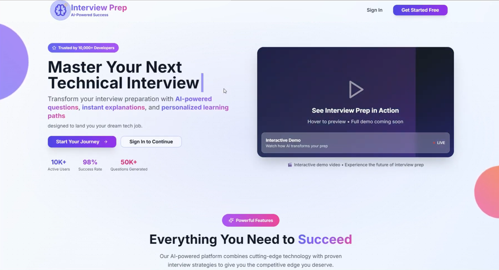
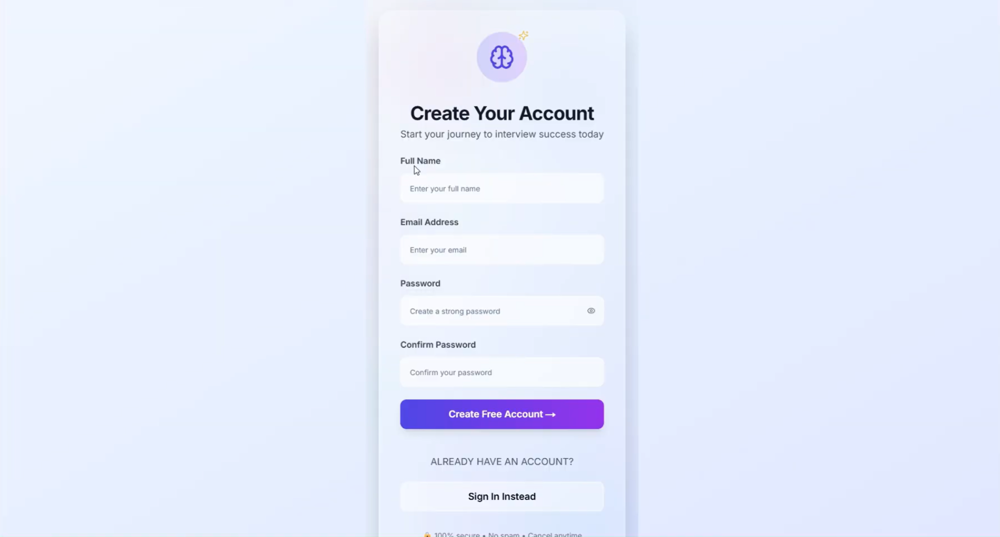
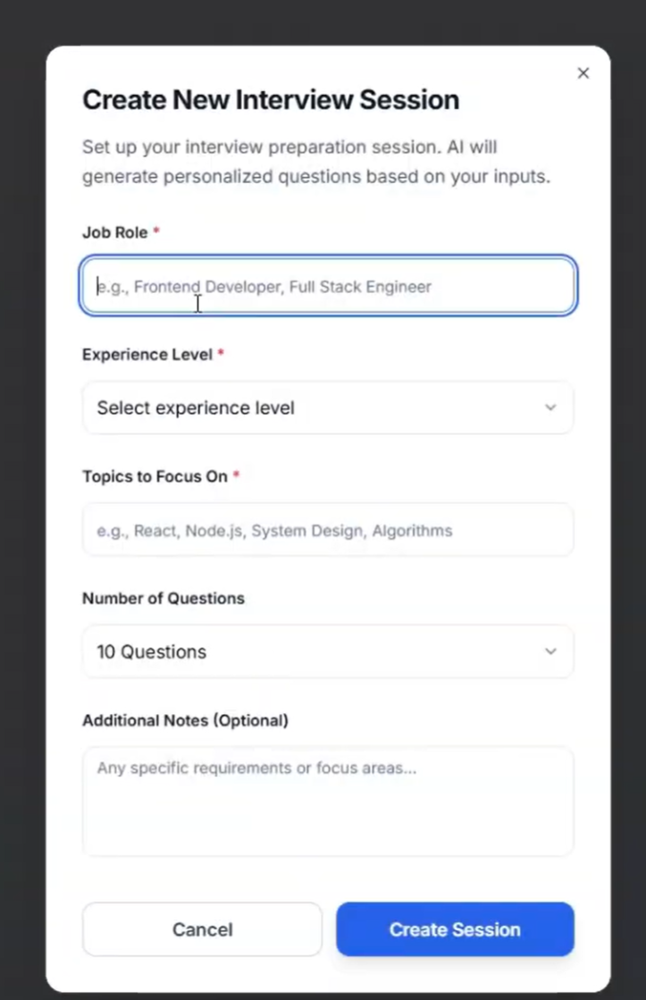
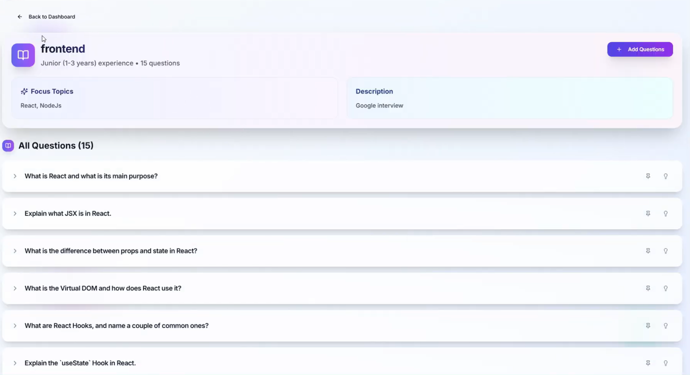
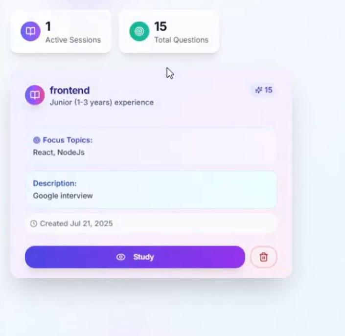
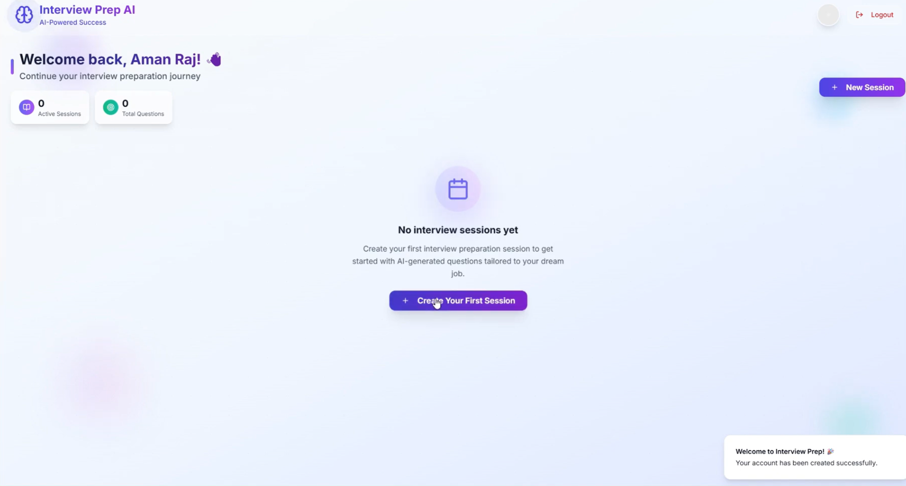
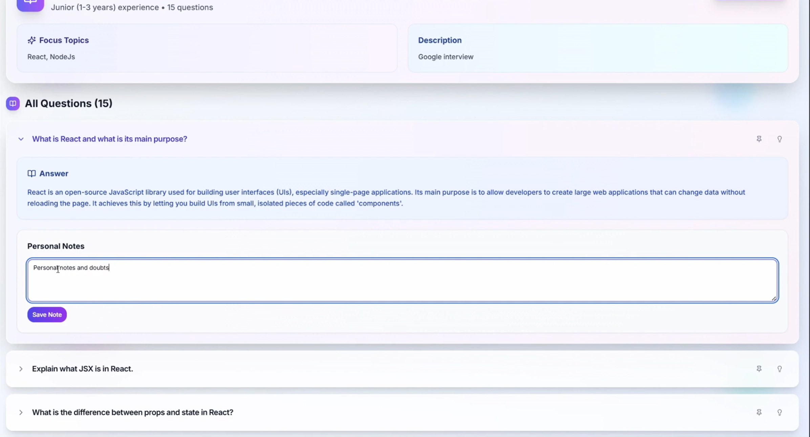
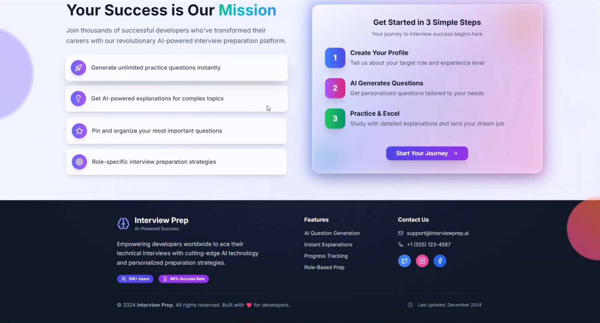

# 🤖 Interview Prep AI

An AI-powered interview preparation platform that simulates technical interviews, generates role-specific questions, and provides structured feedback using Google’s Gemini AI.

The system mirrors real interview workflows while remaining scalable, stateless, and production-ready.

---

## 📌 Problem Statement

Most interview preparation platforms rely on static question banks and generic practice flows. They fail to adapt to:

- Specific job roles and experience levels  
- Real-world interview depth and progression  
- Personalized feedback loops  

This project solves that by leveraging Generative AI to dynamically conduct mock interviews, generate adaptive questions, and provide structured feedback — closely simulating real technical interviews.

---

## 🚀 Key Features

### 🧠 AI Mock Interviews
- Simulates interviewer-driven sessions based on role and experience level  
- Dynamically adapts question flow  
- Context-aware progression  

### 📊 Real-Time AI Feedback
- Evaluates answers for correctness, clarity, and depth  
- Highlights strengths and areas for improvement  
- Structured feedback output  

### 📘 Concept Explanations
- On-demand explanations for technical topics  
- Reinforces weak areas identified during the session  

### 🗂️ Session Management
- Persist interview sessions  
- Review previous answers  
- Track progress over time  

### 📌 Question Management
- Pin important questions  
- Attach personal notes  

### 🔐 Secure Authentication
- JWT-based authentication  
- Hashed passwords with bcrypt  

### 🗄️ Dual Database Strategy
- **Production:** MongoDB Atlas  
- **Development:** Local JSON-based mock database (offline mode)

---

## 🖼️ Application Screenshots

### 🔹 Landing Page
Introduces the platform and guides users toward starting mock interviews.



---

### 🔹 Authentication
Secure login flow with JWT-based authentication.



---

### 🔹 Interview Setup / Query Input
Users provide role, job description, or topic to generate interview questions.




---

### 🔹 Interview Session Creation
AI-driven session creation based on user input.



---

### 🔹 Interview Session Page
Live mock interview experience with AI-generated questions and feedback.



---

### 🔹 Question Review & Notes
Users can pin important questions and add personal notes.



---

### 🔹 Front Page Overview
High-level view of platform capabilities and navigation.



---

## 🧠 Engineering Highlights
```
- Designed a **stateless backend** using JWT authentication for horizontal scalability  
- Implemented structured prompt templating to ensure consistent AI outputs  
- Added fallback data storage to enable development without external dependencies  
- Structured API routes to minimize cold-start latency in serverless environments  
- Separated AI logic, session management, and authentication layers for maintainability  
```
---

## 🛠️ Tech Stack

### Frontend
- Next.js 14 (App Router)  
- Tailwind CSS  
- Shadcn UI  

### Backend
- Node.js  
- Next.js API Routes  
- JWT  
- Bcrypt  

### AI Layer
- Google Gemini 2
- Role-aware question generation  
- Structured feedback + concept explanations  

### Database
- MongoDB (Mongoose)  
- Local JSON Store (development fallback)  

---

## ⚙️ Architecture & Workflow
```
1. User starts an interview session  
2. Backend validates authentication and input  
3. Structured prompts are generated  
4. Gemini API processes and returns response  
5. AI responses are validated and normalized  
6. Session data is stored and streamed back to UI  
```
### Design Trade-offs
```
- External AI API used instead of self-hosted models to reduce infrastructure complexity  
- MongoDB chosen for schema flexibility  
- Stateless auth preferred over server-side sessions for scalability  
```
---

## 🧪 Development & Reliability Notes
```
- **Offline Mode:** Automatically switches to local JSON DB if MongoDB is unavailable  
- **Error Handling:** Handles malformed AI responses gracefully  
- **Security:** Environment-scoped JWT secrets, hashed passwords  
```
---

## 📁 Project Structure
```bash
Interview-prep-ai/
├── app/api/           # Auth, AI, session routes
├── components/        # Reusable UI components
├── lib/               # DB connections, utilities, mock DB
├── models/            # Mongoose schemas
├── hooks/             # Custom React hooks
├── public/            # Static assets
└── README.md
```


---

## ▶️ Local Setup

```bash
git clone https://github.com/Pranjalraj0404/Interview-prep-ai
cd Interview-prep-ai
npm install
npm run dev
```
Create a .env file in the root:
```
MONGODB_URI=your_mongodb_connection_string
ACCESS_TOKEN_SECRET=your_random_secret
DISABLE_API_AUTH=false
GEMINI_API_KEY=your_gemini_api_key
```

---

## 🙌 Acknowledgements

- Google Gemini API for powering dynamic AI-driven interview simulations  
- MongoDB Atlas for scalable cloud database infrastructure  
- The open-source community for tools and UI libraries that accelerated development  

Special thanks to everyone who provided feedback during development and testing.

---

## 📬 Contact

If you’d like to collaborate, suggest improvements, or discuss system design decisions:

- GitHub: https://github.com/Pranjalraj0404  
- LinkedIn: https://www.linkedin.com/in/pranjalraj0404

Feel free to open issues or contribute!
